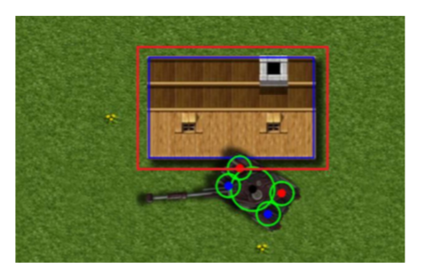
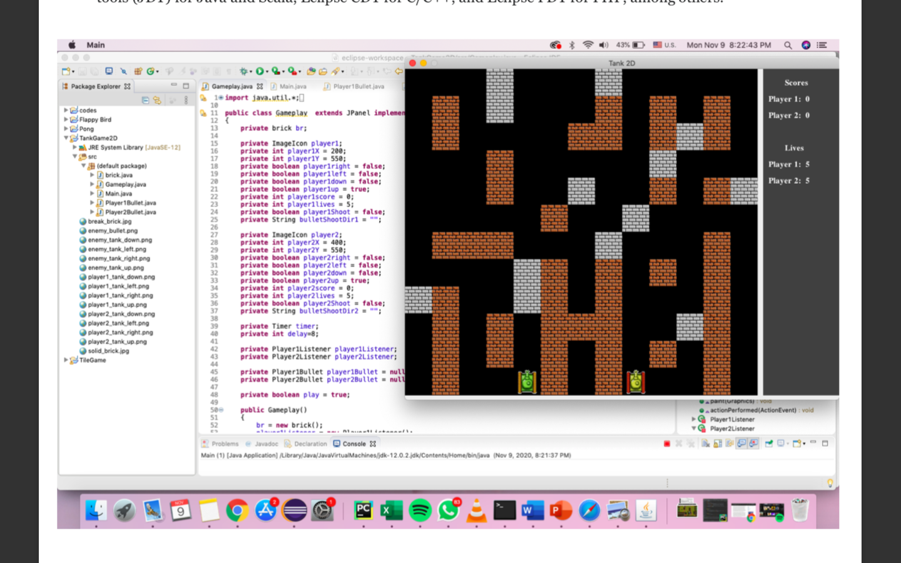
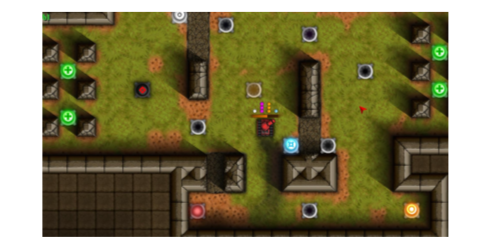
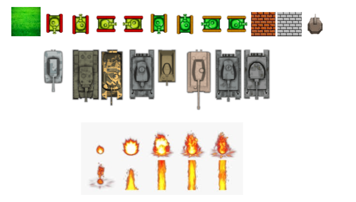

# Tank-2D-game
Tank 2d is a retro game about the world of tank battles. Classic tanks made in retro style. Collect coins to upgrade your tank's stats, purchase and improve weapons. Complete missions and unlock all levels in battle tanks.

(1) Start the game, select the option of starting the game in the selecting menu in the user’s angle, press down the confirm key; the computer responds to trigger the pictures of beginning the game for several seconds; then, it begins to trigger the background pictures and tank to complete the game initialization.

(2) display the menu window; the player carries out selection.

(3) select game level; the user confirms it through selecting the level in the menu.

(4) control the tank’s direction; when the user emits the direction command to the tank, the computer responses and triggers the algorithm in run() method to carry out plus/minus calculation to the tank’s current coordinate after calculation, the tank’s current coordinate value is changed and shown on the screen through the tank image of the threading so as to complete the control to the tank moving; and the user directly control the use case.

(5) The bullets emitted by both parties need to be controlled and tracked; it requires the shooting place to be in the independent threading. The player’s tank needs to scan the enemy’s all tanks in each process; and the enemy’s tank only needs to scan the player’s tank.

<table>
<tr>
<td></td>
<td></td>
</tr>
</table>

(6) Shoot bullet; when the user clicks to enter the game, the computer triggers the threading to remap the tank picture on the phone screen. The use case is controlled by the computer directly and the user can’t control it.

(7) Control the enemy’s tank; the user can’t control it; it is controlled by the system.

(8) Both parties need to consider whether their tanks will hit the enemy’s tank in the marching process to avoid overlaying in operation and causing many situations inconsistent with the design.

(9) When the user is operating the game, he/she needs the score recording function. It adopts a reasonable scoring standard and designs the scoring standard.

(10) The player’s camp has a base camp; when the bullet hits the base camp, the computer can judge to terminate the game and control it based on the condition.

(11) Terminate the game; the user in the game can’t terminate the game directly; when the life value of the tank controlled by the user is zero, the computer can judge to terminate the game and control it based on the condition.

<table>
<tr>
<td></td>
<td></td>
</tr>
</table>
